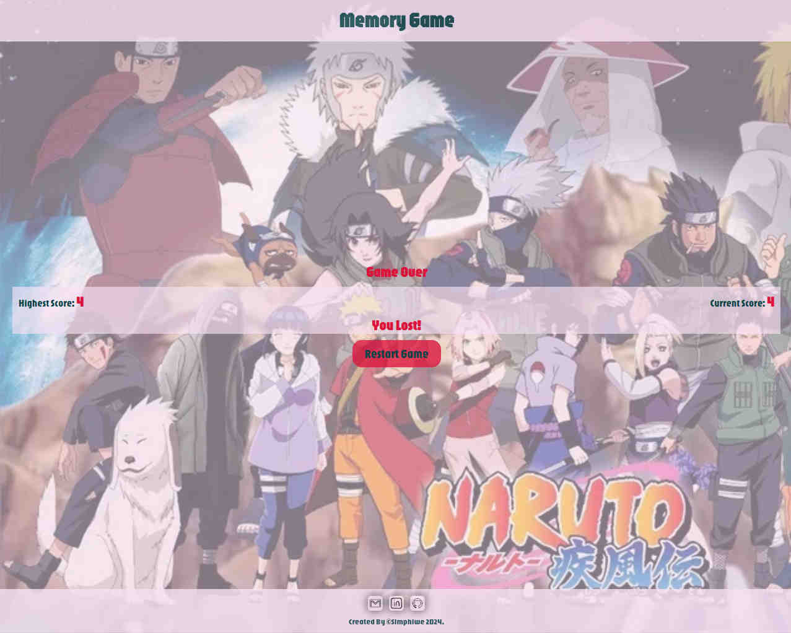

# MEMORY GAME

Check it _**LIVE**_ 👉
**<https://deebest.github.io/memory-game/>**

A _**Memory Game**_ web application I built with HTML,CSS,JavaScript and react.

## Uses

Users can test their memory by playing the game, they are not allowed to click on the same image twice, else the lose the game.

## Tech Stack Used

- GIT
- HTML
- CSS
- JavaScript
- React

## Get In Touch 👇

Email : **<simphiwedladla8@gmail.com>**

Linked: **<https://www.linkedin.com/in/dladla-simphiwe-89061a20a/>**

Github: **<https://github.com/DeeBest>**

Portfolio: **<https://deebest.github.io/personal-webpage/>**

## Credits

images from the NarutoDb api, link below.
**<https://narutodb.xyz>**
